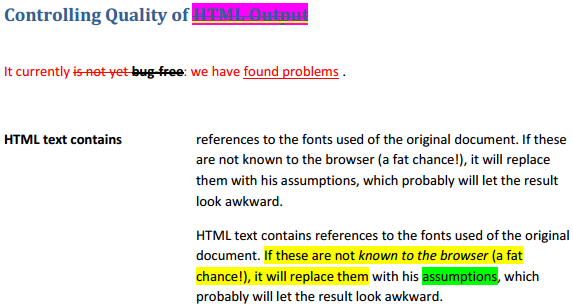
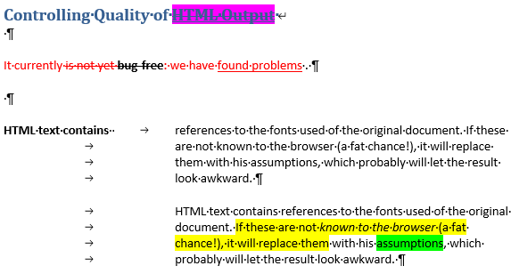

# pdf2docx

- Parse layout/text format of PDF file with `PyMuPDF`
- Generate docx with `python-docx`

## Features

- [x] Rebuild page layout in docx
- [x] Parse and re-create text format, e.g. bold, italic, color, highlight, underline, strike-through-line (single strike only)
- [ ] Parse and re-create list style
- [ ] Parse and re-create table

## Usage

```python
import os
from pdf2docx import Reader, Writer

dir_output = '/path/to/output/dir/'
filename = 'demo-text'
pdf_file = os.path.join(dir_output, f'{filename}.pdf')
docx_file = os.path.join(dir_output, f'{filename}.docx')

pdf = Reader(pdf_file)
docx = Writer()

for page in pdf[0:1]:
    # debug mode: plot layout in new PDF file with PyMuPDF
    layout = pdf.parse(page, 
        debug=True, 
        filename=os.path.join(dir_output, 'illustration.pdf'))

    # re-create docx page
    docx.make_page(layout)

docx.save(docx_file)
```

## Samples

### Text format

It's able to re-build common text format, e.g. font color, bold, italic, highlight, and their combinations. However, there're still deviations existed in detail, e.g. color of underline (see words `HTML Output`), the applied range of text format (see words `bug-free`, `assumptions`).

- PDF



- docx




### List

*TODO*

### Table

*TODO*