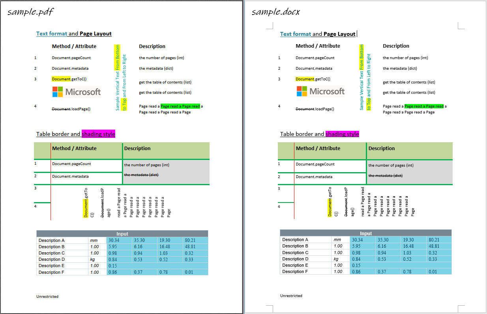

.. include:: header.rst

Welcome to pdf2docx
====================================

:title:`pdf2docx` is a **Python** library
to extract data from **PDF** with PyMuPDF_, parse layout with rule, and
generate **docx** files with ``python-docx``.

:title:`pdf2docx` is hosted on `GitHub <https://github.com/ArtifexSoftware/pdf2docx>`_ and registered on `PyPI <https://pypi.org/project/pdf2docx/>`_.

----

.. toctree::
   :maxdepth: 2
   :caption: USER GUIDE

   installation
   quickstart
   techdoc
   license

.. toctree::
   :maxdepth: 2
   :caption: API DOCUMENTATION

   api/modules

Indices and tables
==================

* :ref:`genindex`
* :ref:`modindex`

.. include:: footer.rst

.. _PyMuPDF: https://pymupdf.io
